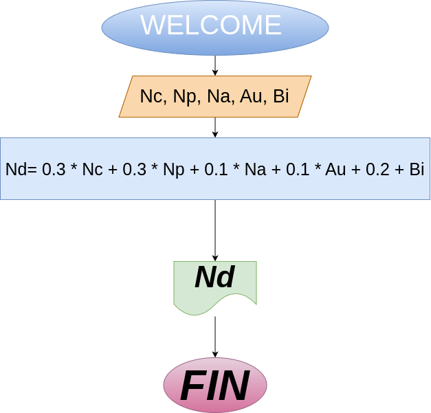

# nota_definitiva
programa en Python para calcular la nota definitiva de una asignatura del Colegio Guanentá

# Instrucciones
- Al ingresar las notas de la asignatura, utilice valores enteros entre 10 y 50.
- No use puntos decimales (`.`), ya que el programa solo acepta números enteros.

# Diagrama de flujo:
